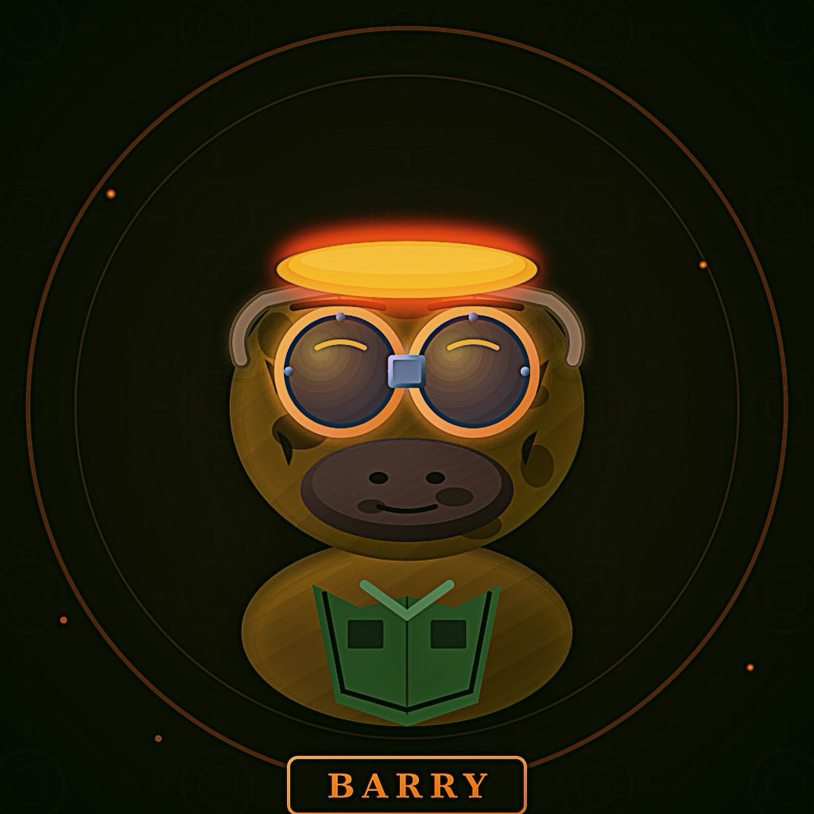

# barry-avatars

Artwork for [Barry](https://github.com/perintyler/barry-dev) the platypus.

<p align="center">
  
</p>

## The files

| File | What it is |
| --- | --- |
| `barry.png` / `barry.svg` | The main portrait. Start here. |
| `barry-rounded.png` | Same portrait, rounded corners. |
| `barry-rounded-16.png` / `barry-rounded-32.png` | Favicon sizes. |
| `barry-infant.svg` | Baby Barry. |
| `barry-bozo-brown.PNG` | Bozo Barry, brown. |
| `barry-bozo-brown-1280x640.png` | Bozo Barry sized for social cards. |
| `barry-by-rachel.jpg` | Barry, drawn by Rachel. |
| `barry-live-action.png` | Live-action Barry. |
| `barry-actually-throws-a-rock.png` | Barry actually throws a rock. |

## Linking to these

Raw files are served from GitHub, so anything outside this repo can hotlink them:

```
https://raw.githubusercontent.com/perintyler/barry-avatars/main/barry.png
```

In Markdown that renders on GitHub, a plain absolute URL to the blob page works too.
